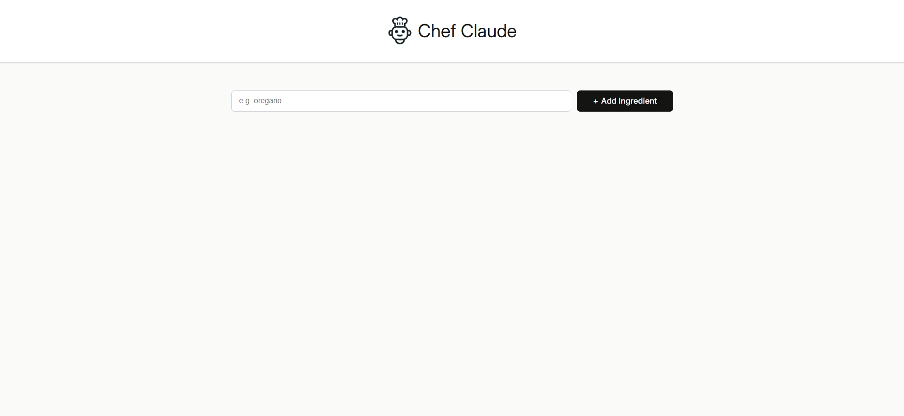

# Chef Claude


**Generate AI-powered recipes for your ingreients!**
Chef Claude uses the 'minxtarl-8x7b' model via Hugging Face to create delicious recipes based on the ingredients you input. Simply list what you have, and let Chef Claude do the rest!

---

## Table of Contents
- [Features](#features-)
- [Demo](#demo-)
- [Tech Stack](#tech-stack-)
- [Installation](#installation-)
- [Usage](#usage-)
- [FAQs](#faqs-)

---
<a name="features"></a>
## Features ✨
- **AI Recipe Generation**: Input ingredients, get a tailored recipe.
- **Simple Interface**: Clean React-based UI with responsive design.
- **API Integration**: Powered by Hugging Face’s Inference API.
- **Local Development**: Easy setup with npm and environment variables.

---
<a name="demo"></a>
## Demo 📸

See how Chef Claude works from start to finish:

1. Landing Page:
 The homepage where users can start by entering their ingredients.
  
2. Adding Ingredients (4):
After adding at least 4 ingredients, the "Get Recipe" button becomes visible.
 
3. AI-generated Ingredients:
After submitting the ingredients, the AI tells the user which ingredients to use and the exact amounts.
 
4. Recipe Instructions:
The user can view the full recipe instructions after the recipe is generated.
 
---
<a name="tech-stack"></a>
## Tech Stack 🛠️
- **Frontend**: React, JavaScript, HTML, CSS
- **AI Model**: `mixtral-8x7b` via [Hugging Face](https://huggingface.co/mistralai/Mixtral-8x7B-v0.1)
- **Tools**: npm, Vite

---
<a name="installation"></a>
## Installation ⚙️
1. Clone the repository:
   ```bash
   git clone https://github.com/tenbite-daniel/chef-claude.git
   cd chef-claude
   ```
2. Install dependencies:
   ```bash
   npm install
   ```
3. Add your Hugging Face API key:
   - Create a `.env` file in the root directory.
   - Add this line (replace `your_api_key_here`):
     ```env
     VITE_HF_ACCESS_TOKEN=your_api_key_here
     ```
4. Start the app:
   ```bash
   npm run dev
   ```
---
<a name="usage"></a>
## Usage 🥑
1. Open the app in your browser by going to `http://localhost:5173` (or the port displayed in the terminal after running `npm run dev`).
2. Enter each ingredient **separately** in the input field. For example, instead of typing "chicken, rice, garlic" all at once, enter "chicken", then click **Add Ingredient**, and repeat for the rest of your ingredients.
    **Note:** The minimum number of ingredients required is **4**. 
3. Click **Generate Recipe**.
4. Wait ~10-20 seconds for the AI to work its magic!

---
<a name="faqs"></a>
## FAQs ❓
### Q: Where do I get the Hugging Face API key?
A: Sign up at [Hugging Face](https://huggingface.co/), go to [Settings > Tokens](https://huggingface.co/settings/tokens), and create a token with **Inference API** access.

### Q: Why is the recipe taking so long to generate?
A: The free-tier Hugging Face Inference API has limited speed. For faster results, consider upgrading your API plan.

### Q: Is there a limit on the number of requests I can make with the free-tire Hugging Face API?
A: Yes, the free-tire Hugging Face API allows up to **20 requests per month**. Once the limit is reached, you may need to wait for the next month or consider upgrading to a paid plan.

### Q: Can I add dietary restrictions?
A: Not yet! This is a planned feature. Feel free to contribute!
